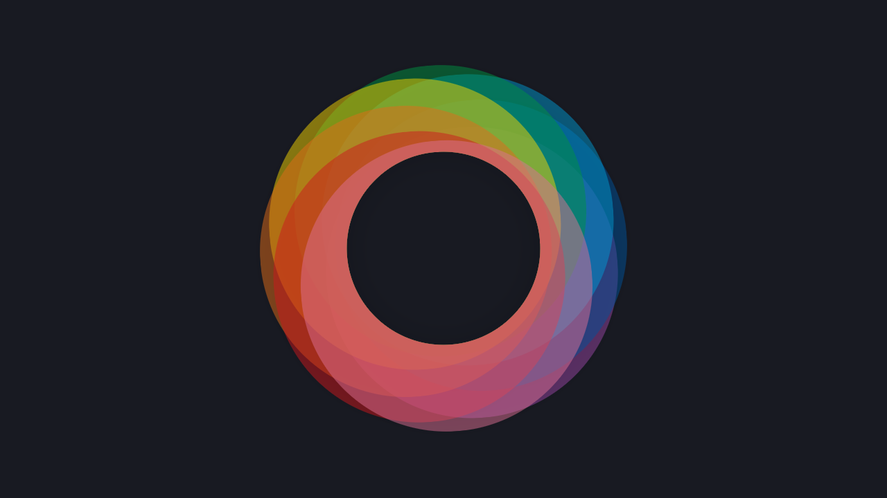

# `möbius`

> Generate harmonious, customizable color palettes from a single base color - instantly and programmatically.

          

- [`möbius`](#möbius)
  - [About](#about)
  - [Features](#features)
  - [Documentation](#documentation)
  - [Try it online](#try-it-online)
  - [Contributing](#contributing)
  - [License](#license)
  - [Changelog](#changelog)
  - [Sponsor me](#sponsor-me)

## About

Möbius is a color palette generation tool designed for developers and designers who need quick, consistent, and attractive color schemes. It supports a wide variety of palette types and exports color data in multiple formats - RGB, HSL, LAB, CMYK, and more - making it ideal for both web design and data visualization.

## Features

- Generate palettes using:
  - Interpolation
  - Luminance shifts
  - Monochromatic, Complementary, Analogous, Triadic, Tetradic, etc.
- Output in multiple color spaces: RGB, HSL, LCH, CMYK, etc.
- Randomized or lightness-corrected options
- Diverging palette support
- TypeScript-friendly API

## Documentation

Checkout the documentation at [https://phun-ky.net/moebius/](https://https://phun-ky.net/moebius/).

## Try it online

You can check out the online-generator at [moebius.wtf](https://moebius.wtf/).

## Contributing

Want to contribute? Please read the [CONTRIBUTING.md](https://github.com/phun-ky/moebius/blob/main/CONTRIBUTING.md) and [CODE_OF_CONDUCT.md](https://github.com/phun-ky/moebius/blob/main/CODE_OF_CONDUCT.md)

## License

This project is licensed under the MIT License - see the [LICENSE](https://github.com/phun-ky/moebius/blob/main/LICENSE) file for details.

## Changelog

See the [CHANGELOG.md](https://github.com/phun-ky/moebius/blob/main/CHANGELOG.md) for details on the latest updates.

## Sponsor me

I'm an Open Source evangelist, creating stuff that does not exist yet to help get rid of secondary activities and to enhance systems already in place, be it documentation or web sites.

The sponsorship is an unique opportunity to alleviate more hours for me to maintain my projects, create new ones and contribute to the large community we're all part of :)

[Support me on GitHub Sponsors](https://github.com/sponsors/phun-ky).

p.s. **Ukraine is still under brutal Russian invasion. A lot of Ukrainian people are hurt, without shelter and need help**. You can help in various ways, for instance, directly helping refugees, spreading awareness, putting pressure on your local government or companies. You can also support Ukraine by donating e.g. to [Red Cross](https://www.icrc.org/en/donate/ukraine), [Ukraine humanitarian organisation](https://savelife.in.ua/en/donate-en/#donate-army-card-weekly) or [donate Ambulances for Ukraine](https://www.gofundme.com/f/help-to-save-the-lives-of-civilians-in-a-war-zone).
