# @phun-ky/moebius `möbius`

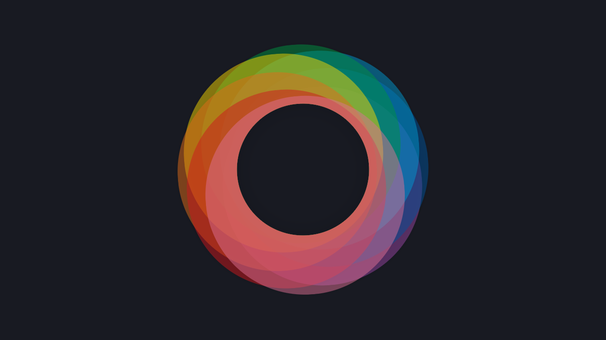

> Automatically generate color palettes!

[](http://commitizen.github.io/cz-cli/) [](http://makeapullrequest.com) [](http://semver.org/spec/v2.0.0.html)       [](https://codecov.io/gh/phun-ky/moebius) [](https://github.com/phun-ky/moebius/actions/workflows/check.yml)

- [@phun-ky/moebius `möbius`](#phun-kymoebius-möbius)
  - [About](#about)
  - [Demo](#demo)
  - [Install](#install)
  - [API](#api)
  - [Usage](#usage)
    - [Creating paletts](#creating-paletts)
      - [Default options](#default-options)
      - [Interpolate](#interpolate)
      - [Luminance shift](#luminance-shift)
      - [Monochromatic](#monochromatic)
      - [Complement](#complement)
      - [Split](#split)
      - [Triadic](#triadic)
      - [Tetradic](#tetradic)
      - [Pentadic](#pentadic)
      - [Hexadic](#hexadic)
      - [Analogous](#analogous)
    - [Get color objects](#get-color-objects)
      - [toString](#tostring)
      - [toObject](#toobject)
      - [toFloat](#tofloat)
    - [Types](#types)
  - [Contributing](#contributing)
  - [License](#license)
  - [Changelog](#changelog)
  - [Sponsor me](#sponsor-me)

## About

@phun-ky/moebius (Möbius) was created to fit a need I had regarding color palette generation, and as a little challenge to myself. I was never happy with the current online palette generators, and I did not want a "set up" palette, I wanted something that was generated, ready to use, and something that I could use as inspiration on colors to choose from in my projects.

## Demo

You can check out a working CodePen where you can [adjust settings and colors here](https://codepen.io/phun-ky/full/LYqQMqL), or the website [moebius.wtf](https://moebius.wtf/).

## Install

```shell-session
npm i -S @phun-ky/moebius
```

## API

Go [here](https://github.com/phun-ky/moebius/blob/main/api/README.md) to read the full API documentation.

## Usage

Import and run the required function:

```ts
import Moebius from '@phun-ky/moebius';

const { MoebiusColor, MoebiusPalettes } = await Moebius();
```

### Creating paletts

The main feature is the ability to create palettes with a given primary color and a secondary color (used for diverging palettes). You can also give the color to diverge to/from.

#### Default options

```ts
const defaultOptions = {
  diverging: false,
  bezier: false,
  randomOffset: false,
  correctLightness: false,
  noDuplicates: true,
  colorScaleMode: 'lch',
  reverseDirection: false,
  divergentColor: '#f5f5f5'
};
```

You initiate `MoebiusPalette` like this:

```ts
import Moebius from '@phun-ky/moebius';

const { MoebiusPalette, MoebiusColor } = await Moebius();

const palettes = new MoebiusPalettes({
  baseColor: new MoebiusColor('#003f5c'),
  secondaryColor: new MoebiusColor('#ff9900'),
  ...options
});
```

And then you can enjoy your palettes!

#### Interpolate

```ts
console.log(palettes.colors.interpolate);
/*
[
  "#003f5c",
  "#2b4e4d",
  "#555d3d",
  "#806c2e",
  "#aa7b1f",
  "#d58a0f",
  "#ff9900"
]
*/
```

Gives you an array of hex-colors.

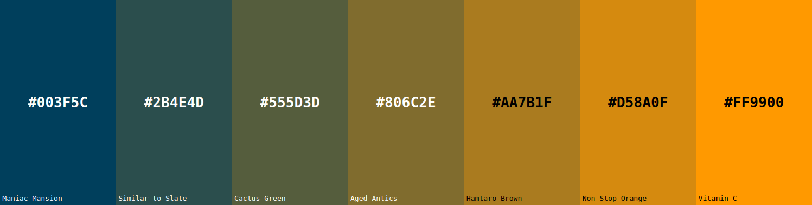

#### Luminance shift

```ts
console.log(palettes.colors.luminanceShift);
/*
[
  "#003f5c",
  "#5f8bac",
  "#b3dff2",
  "#f5f5f5",
  "#fcb852",
  "#d17300",
  "#762800"
]
*/
```

Gives you an array of hex-colors.
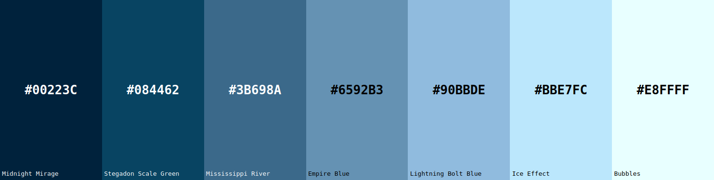

If you diverge them, it could look like this:
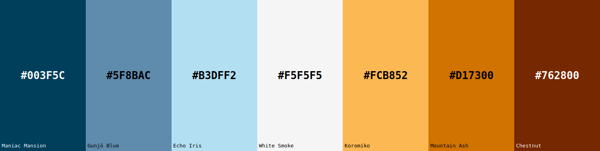

#### Monochromatic

```ts
console.log(palettes.colors.monochromatic);
/*
[
  "#003f5c",
  "#003342",
  "#002329",
  "#000e0f",
  "#000000"
]
*/
```

Gives you an array of hex-colors.
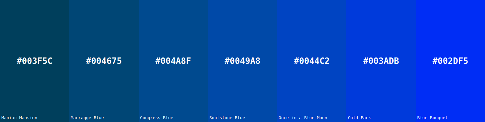

#### Complement

```ts
console.log(palettes.colors.complement);
/*
[
  "#003f5c",
  "#0f394d",
  "#1f343d",
  "#2e2e2e",
  "#3d281f",
  "#4d230f",
  "#5c1d00"
]
*/
```

Gives you an array of hex-colors.
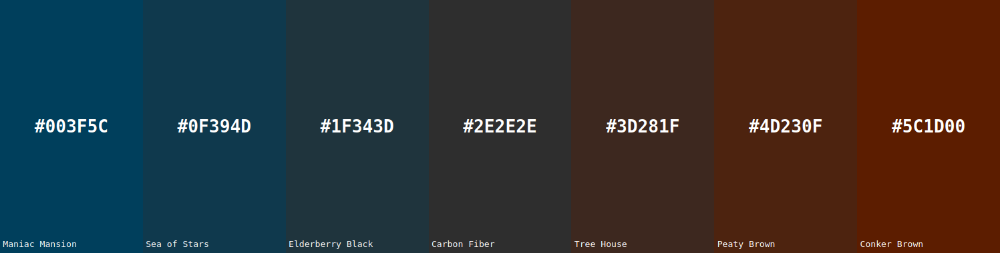

#### Split

```ts
console.log(palettes.colors.split);
/*
[
  "#003f5c",
  "#1f2a43",
  "#3d152a",
  "#5c0011",
  "#5c190b",
  "#5c3206",
  "#5c4b00"
]
*/
```

Gives you an array of hex-colors.
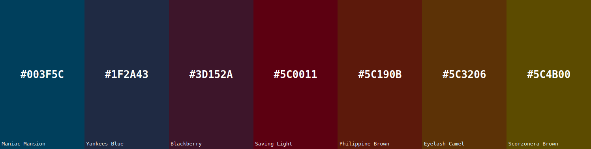

#### Triadic

```ts
console.log(palettes.colors.triadic);
/*
[
  "#003f5c",
  "#1f2a52",
  "#3d1549",
  "#5c003f",
  "#521f2a",
  "#493d15",
  "#3f5c00"
]
*/
```

Gives you an array of hex-colors.
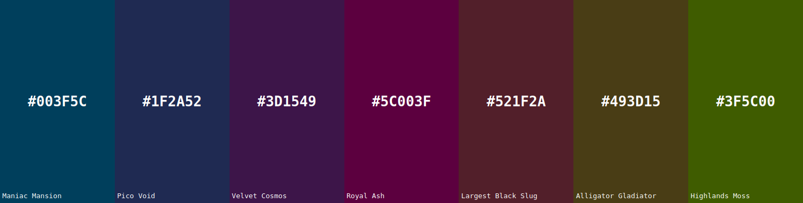

#### Tetradic

```ts
console.log(palettes.colors.tetradic);
/*
[
  "#003f5c",
  "#26205c",
  "#4b005c",
  "#540f2e",
  "#5c1d00",
  "#363d00",
  "#115c00"
]
*/
```

Gives you an array of hex-colors.
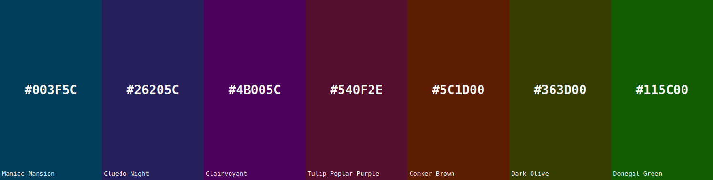

#### Pentadic

```ts
console.log(palettes.colors.pentadic);
/*
[
  "#003f5c",
  "#2e203b",
  "#5c001a",
  "#5c2a0d",
  "#5c5400",
  "#2e5806",
  "#005c0b"
]
*/
```

Gives you an array of hex-colors.
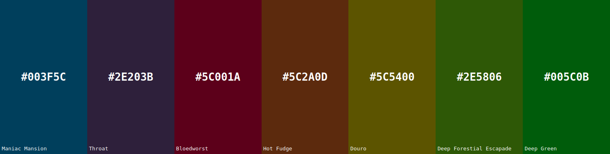

#### Hexadic

```ts
console.log(palettes.colors.hexadic);
/*
[
  "#003f5c",
  "#3d1549",
  "#5c0a2a",
  "#5c1d00",
  "#494700",
  "#2a5c0a",
  "#005c1d"
]
*/
```

Gives you an array of hex-colors.
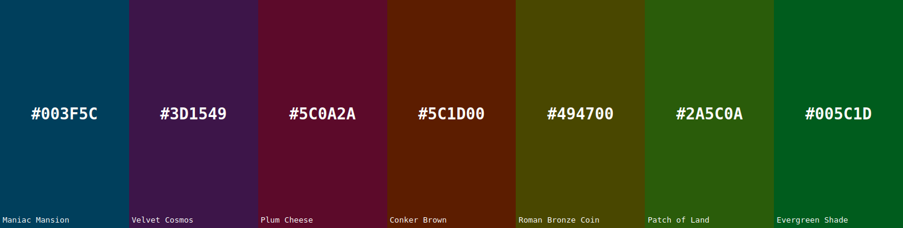

#### Analogous

```ts
console.log(palettes.colors.interpolate);
/*
[
  "#003f5c",
  "#00285c",
  "#00115c",
  "#0f085c",
  "#1d005c",
  "#34005c",
  "#4b005c"
]
*/
```

Gives you an array of hex-colors.
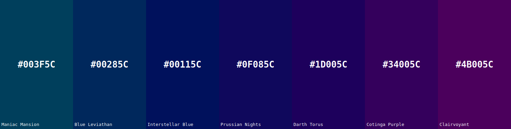

### Get color objects

```ts
import Moebius from '@phun-ky/moebius';

const { MoebiusColor } = await Moebius();

//
const color = new MoebiusColor('#003f5c');

console.log(color.hsl); // hsl(199, 100%, 18%);
```

This will make available a color object with all of the colors readily converted and ready to use. This is an example output of the color object:

```json
{
  "color": "#003f5c",
  "name": "Maniac Mansion",
  "hex": "#003f5c",
  "rgb": "rgb(0, 63, 92)",
  "hsl": {
    "h": 199,
    "s": 100,
    "l": 18
  },
  "hwb": {
    "h": 0.45,
    "w": 0,
    "b": 0.64
  },
  "hsv": {
    "h": 198.91,
    "s": 1,
    "v": 0.36
  },
  "lab": {
    "l": 24.72,
    "a": -5.95,
    "b": -22.26
  },
  "xyz": {
    "x": 0.37,
    "y": 0.43,
    "z": 0.38
  },
  "lch": {
    "l": 24.72,
    "c": 23.04,
    "h": 255.03
  },
  "oklch": {
    "l": 0.35,
    "c": 0.08,
    "h": 236.65
  },
  "hsi": {
    "h": 197.96,
    "s": 1,
    "i": 0.2
  },
  "oklab": {
    "l": 0.35,
    "a": -0.04,
    "b": -0.06
  },
  "cmyk": {
    "c": 100,
    "m": 0,
    "y": 32,
    "k": 64
  }
}
```

#### toString

For the non-CSS units, the color object also exposes a `toString` method pr unit:

```ts
const color = new MoebiusColor('#003f5c');

console.log(color.hsl.toString()); // "199, 100, 18"
```

#### toObject

The color object exposes a `toObject` method, that allows to objectify from any color unit given to either a color object for the hsl units, or default rgb:

```ts
const color = new MoebiusColor('#003f5c');

console.log(color.toObject('hsl')); // "199, 100, 18"
console.log(color.toObject(); // "0, 63, 92"
```

#### toFloat

The color object exposes a `toFloat` method, that allows to objectify to float values, as in `0-1` instead of `0-255`/`0-100` from any color unit given to either a color object for the hsl units, or default rgb:

```ts
const color = new MoebiusColor('#003f5c');

console.log(color.toFloat('hsl')); // "199, 1, 0.18"
console.log(color.toFloat(); // "0, 0.25, 0.36"
```

### Types

Types can be found in `@phun-ky/moebius/moebius.d.ts`.

## Contributing

Want to contribute? Please read the [CONTRIBUTING.md](https://github.com/phun-ky/moebius/blob/main/CONTRIBUTING.md) and [CODE_OF_CONDUCT.md](https://github.com/phun-ky/moebius/blob/main/CODE_OF_CONDUCT.md)

## License

This project is licensed under the MIT License - see the [LICENSE](https://github.com/phun-ky/moebius/blob/main/LICENSE) file for details.

## Changelog

See the [CHANGELOG.md](https://github.com/phun-ky/moebius/blob/main/CHANGELOG.md) for details on the latest updates.

## Sponsor me

I'm an Open Source evangelist, creating stuff that does not exist yet to help get rid of secondary activities and to enhance systems already in place, be it documentation or web sites.

The sponsorship is an unique opportunity to alleviate more hours for me to maintain my projects, create new ones and contribute to the large community we're all part of :)

[Support me on GitHub Sponsors](https://github.com/sponsors/phun-ky).


p.s. **Ukraine is still under brutal Russian invasion. A lot of Ukrainian people are hurt, without shelter and need help**. You can help in various ways, for instance, directly helping refugees, spreading awareness, putting pressure on your local government or companies. You can also support Ukraine by donating e.g. to [Red Cross](https://www.icrc.org/en/donate/ukraine), [Ukraine humanitarian organisation](https://savelife.in.ua/en/donate-en/#donate-army-card-weekly) or [donate Ambulances for Ukraine](https://www.gofundme.com/f/help-to-save-the-lives-of-civilians-in-a-war-zone).
